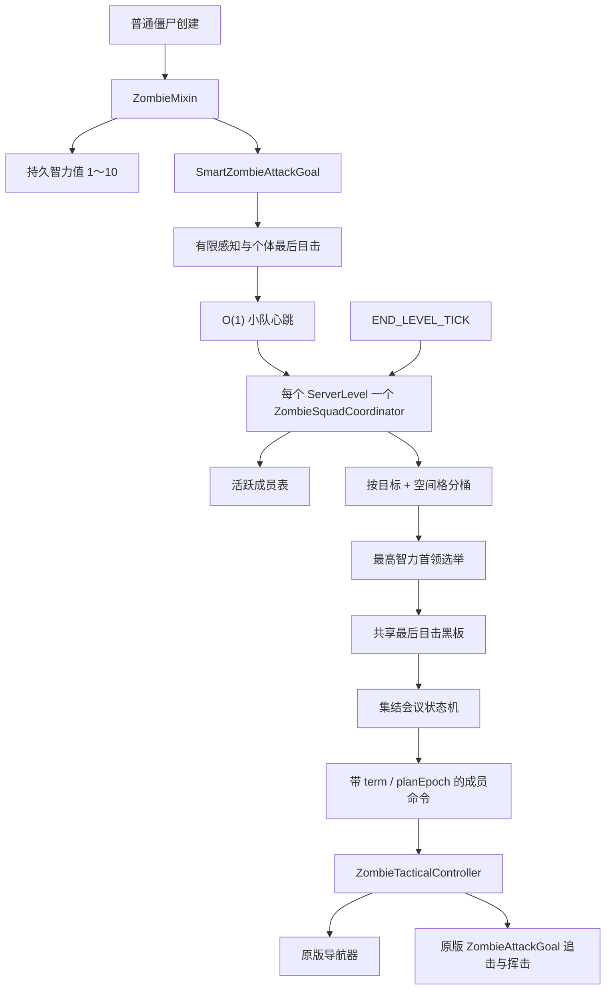
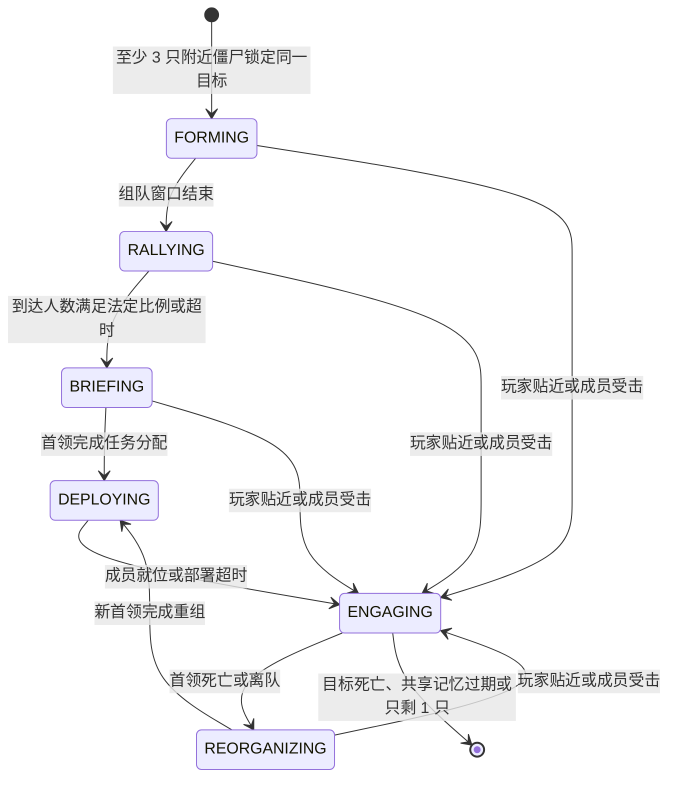

# 《怪物不再愚蠢 / Mobs Think Now》技术架构

> 当前状态：M1“僵尸小队首领”首版已经实现。目标版本为 Minecraft Java
> 26.1.2、Fabric Loader 0.19.3、Fabric API 0.155.2+26.1.2、Java 25。

## 1. 首版边界

- 只改造原版普通僵尸 `minecraft:zombie`；
- 服务端权威，不增加客户端协议、模型或资源；
- 不提高生命、伤害、攻击速度或生成量；
- 复用原版视线、GoalSelector、导航、近战距离和命中判定；
- 世界对象只在服务器主线程访问，不把实体和导航器交给工作线程；
- 尸壳、溺尸、僵尸村民和其他 Mod 实体暂不注入。

## 2. 总体结构



主要职责：

```text
com.wjz.mobsthinknow
├─ MobsThinkNow                         Fabric 初始化与世界事件注册
├─ ai/utility                           通用效用选择器
├─ ai/zombie
│  ├─ SmartZombieAttackGoal             原版 Goal 生命周期边界 + 斧手破盾钩子
│  ├─ ZombieTacticalController          单只僵尸的感知与命令执行
│  ├─ ZombieIntelligence                持久智力值访问
│  ├─ ZombieTacticEvaluator             无小队时的单体战术
│  ├─ ZombieArmory                      武装小队的持械概率、兵种识别与破盾
│  ├─ SmartZombieMetrics                运行指标
│  └─ squad
│     ├─ ZombieSquadCoordinator         组队、黑板、状态机与命令
│     ├─ SquadLeaderElection            确定性首领选举
│     ├─ SquadRolePlanner                智力到战术复杂度的映射 + 兵种职位偏好
│     ├─ SquadTheatrics                 职业名牌、首领光环与会议声画表现层
│     ├─ WeaponClass                    主手武器的战术分类
│     └─ SquadDirective                 单只僵尸收到的只读命令
├─ command/MtnCommands                  status 与 reload
├─ config                               JSON 配置、校验和热重载
└─ mixin/ZombieMixin                    Goal 替换与智力存档注入
```

## 3. 小队生命周期



- `FORMING`：确认成员和首领，生成集结点；
- `RALLYING`：成员向首领附近聚拢；
- `BRIEFING`：非首领转头看向首领，形成可见的“开会”动作；
- `DEPLOYING`：成员按任务从集结点散开；
- `ENGAGING`：正面位交给原版近战 Goal，侧翼和截断位继续执行目的地；
- `REORGANIZING`：首领丢失后从存活成员中立即选出继任者，再短暂重组。

若玩家进入默认 5 格警戒距离或任何成员刚刚受击，小队会跳过仪式直接交战，
避免僵尸在玩家面前“坚持开会”。

## 4. 数据生命周期

### 持久数据

每只僵尸第一次需要智力时均匀生成 `1～10`，通过 26.1.2 的
`ValueInput/ValueOutput` 实体存档链写入 `MobsThinkNowIntelligence`。重新进入世界后
数值不变。

### 临时数据

小队 ID、目标引用、首领、职位、集结点、共享黑板和命令只存在内存中。区块卸载、
目标失效、成员心跳超时或服务器停止时会清理；这些引用不会写进存档。

`term` 表示首领任期，换届时递增；`planEpoch` 表示任期内的计划版本，重新集结或
重新部署时递增。这样后续加入网络调试显示时也能识别过期命令。

## 5. 首领与职位

首领选举顺序固定为：

1. 智力值更高；
2. 智力相同时当前生命值更高；
3. 仍相同时实体 ID 更小。

职位复杂度由首领智力决定：

| 首领智力 | 可用方案 |
|---:|---|
| `1～3` | 首领与施压者正面突进 |
| `4～6` | 增加左翼包抄 |
| `7～8` | 增加左右双翼包抄 |
| `9～10` | 增加截断退路位 |

职位包括 `LEADER`、`PRESSURER`、`FLANK_LEFT`、`FLANK_RIGHT` 和 `CUTOFF`。
部署结束后，首领和施压者继续使用原版追击攻击；侧翼只有到达合理攻击角度后才重新
进入原版挥击逻辑。

## 6. 感知与公平性

- 只有 `Sensing.hasLineOfSight` 为真时才刷新目标位置和朝向；
- 小队共享的是成员实际目击过的最后位置，不是墙后玩家的实时坐标；
- 共享记忆默认 60 tick 后过期，小队随后解散；
- 所有战术移动都交给原版导航器，不传送、不穿墙；
- 攻击仍服从原版近战距离、视线和攻击冷却；
- 本版不破坏方块，也不修改 `mobGriefing`。

紧急接敌只会在成员亲眼看到近距离目标或刚刚受击时触发，而且它只切换状态，不绕过
原版命中条件。

## 7. 性能模型

旧实现由每只僵尸调用范围实体查询，密集场景接近 O(N²)。新实现采用：

1. 每只活跃僵尸每 tick 提交一次 HashMap 心跳，O(1)；
2. 默认每 10 tick 才尝试组建新小队；
3. 一次遍历按“目标实体 ID + 空间格”建立索引，O(N)，再按实体 ID 做一次
   O(N log N) 的确定性种子排序；
4. 每个未组队种子只访问九宫格，并把原始候选检查硬限制为
   `maximumCoordinatedZombies * 16`；
5. 默认单队最多 20 只，因此组队阶段上界为 O(N log N + N × 320)；即使把配置
   调到硬上限 100，每个种子的原始候选检查也最多 1600 次，不随总僵尸数平方增长；
6. 已有小队只遍历自己的成员，默认最多 20 只、配置硬上限为 100 只；
7. 路径按决策间隔更新，目的地未明显变化时复用现有 Path。

`/mtn status` 会显示活跃小队、选举/换届次数和累计候选检查数，便于后续做
50、100、200 只激活僵尸的 MSPT 实机基准。

## 8. 关键配置

配置文件：`config/mobsthinknow.json`

| 字段 | 默认值 | 作用 |
|---|---:|---|
| `enabled` | `true` | 总开关 |
| `zombieAiEnabled` | `true` | 僵尸 AI 开关 |
| `packSurrounding` | `true` | 小队系统开关 |
| `decisionIntervalTicks` | `8` | 战术与路径更新间隔 |
| `targetMemoryTicks` | `60` | 最后目击记忆时间 |
| `minimumSquadSize` | `3` | 正式组队最少成员 |
| `maximumCoordinatedZombies` | `20` | 单队成员上限，可配置范围 `4～100` |
| `coordinationRadius` | `12.0` | 同伴协调半径 |
| `squadFormationIntervalTicks` | `10` | 尝试组队间隔 |
| `squadFormationTicks` | `12` | 组队确认窗口 |
| `rallyTimeoutTicks` | `60` | 集结最长时间 |
| `briefingTicks` | `24` | 会议持续时间 |
| `deploymentTimeoutTicks` | `80` | 部署最长时间 |
| `regroupTicks` | `15` | 换届重组时间 |
| `emergencyEngageDistance` | `5.0` | 紧急接敌距离 |
| `rallyQuorum` | `0.7` | 集结完成比例 |
| `deploymentQuorum` | `0.6` | 部署完成比例 |
| `squadVisualEffects` | `true` | 会议叫声、粒子、光环与怒吼 |
| `squadRoleNameTags` | `true` | 组队期间的职业名牌 |
| `armedSquads` | `false` | 武装小队总开关 |
| `armedChanceEasy` | `0.10` | 简单难度持械概率，范围 `0～1` |
| `armedChanceNormal` | `0.25` | 普通难度持械概率，范围 `0～1` |
| `armedChanceHard` | `0.50` | 困难难度持械概率，范围 `0～1` |
| `armedShieldBreakSeconds` | `3.0` | 斧手命中格挡后禁用盾牌秒数，`0` 关闭 |
| `armedFlankSpeedBonus` | `0.12` | 两翼与截断位的机动速度加成 |

所有数值在加载时都会钳制到安全范围。

## 8.1 剧场层与武装小队

表现层（`SquadTheatrics`）完全独立于战术决策：

- 会议阶段首领每 14 tick 低吼一句并冒怒气云，句间由成员轮流应声冒音符，
  形成一来一回的“布置任务”对话；
- 首领常驻金色光环（每 3 tick 少量 dust 粒子）；部署阶段成员拖出职业颜色
  轨迹；进入交战瞬间首领怒吼、成员声浪依次跟上；
- 职业名牌用 `translatableWithFallback` 写入实体 CustomName，未装模组的
  原版客户端显示英文回退；离队/解散/换目标时恢复原名，读档时剥掉异常退出
  可能残留的名牌（名牌会阻止自然消失，必须清理）。

武装小队（`ZombieArmory`，默认关闭）：

- `finalizeSpawn` 尾部按难度掷持械概率，只补空手僵尸，转化路径不参与，
  掉落率维持原版 8.5%；
- 兵种由 `swords/axes/spears` 物品标签识别，规划器在智力决定的职位槽内
  按“斧→施压、剑→两翼、矛→截断”偏好匹配成员；
- 26.1.2 中怪物普通挥击不触发原版 activeItem 破盾判定，因此斧手命中格挡
  目标后由 `BlocksAttacks.disable` 显式补一次盾牌禁用；
- 两翼与截断位机动时获得 `armedFlankSpeedBonus` 的速度加成，上限 1.5。

## 9. 验证体系

- JUnit：效用选择、配置边界、首领选举优先级、低/高智力职位规划；
- Minecraft 服务端 GameTest：生产 Mixin 安装、智力经过真实实体存读链保持不变、
  最高智力首领当选、首领移除后自动换届；
- `runGameTest` 启动真实 Fabric 服务端验证集成；
- `build` 执行编译、JUnit、资源处理和可发布 JAR 打包。

下一阶段仍需补实际地形轨迹测试，以及 50/100/200 只僵尸的 MSPT 与内存基准。
