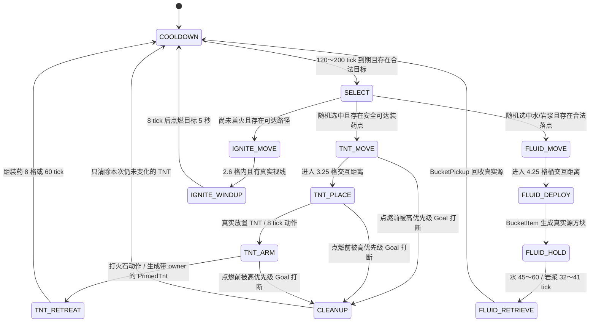
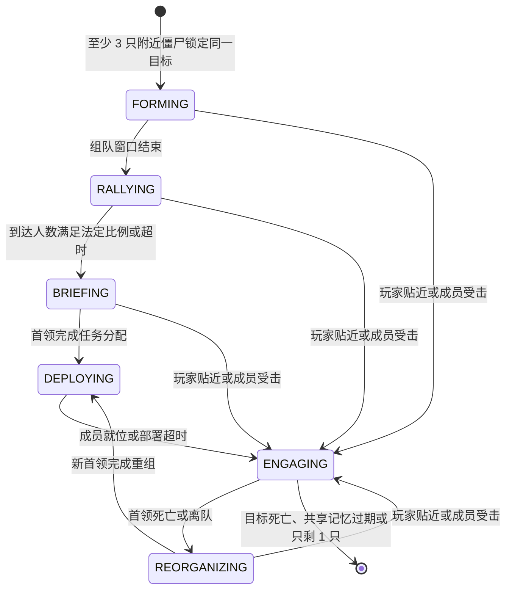

# 《怪物不再愚蠢 / Mobs Think Now》技术架构

> 当前状态：普通僵尸战术、普通骷髅远程战术与跨物种混编小队已经实现。目标版本为 Minecraft Java
> 26.1.2、Fabric Loader 0.19.3、Fabric API 0.155.2+26.1.2、Java 25。

## 1. 首版边界

- 只改造原版普通僵尸 `minecraft:zombie` 与普通骷髅 `minecraft:skeleton`；
- 战术决策保持服务端权威；客户端资源仅负责盾牌像素图案和持盾、进食、举矛、举弩等姿态；
- 不提高生成量；个体速度、最大生命、伤害与追踪距离围绕随难度变化的均值随机浮动；
- 复用原版视线、GoalSelector、导航、近战距离和命中判定；
- 世界对象只在服务器主线程访问，不把实体和导航器交给工作线程；
- 尸壳、溺尸、僵尸村民、骷髅变种和其他 Mod 实体暂不注入。

## 2. 总体结构

```mermaid
flowchart TD
    Spawn["普通僵尸创建"] --> Mixin["ZombieMixin"]
    Mixin --> Intelligence["持久智力值 1～10"]
    Intelligence --> NameTag["名字末尾智力数字"]
    Mixin --> Traits["固定声线 + 难度化永久属性"]
    Mixin --> AttackGoal["SmartZombieAttackGoal / priority 3"]
    Mixin --> RetreatGoal["ReactiveRetreatGoal / priority 1"]
    Mixin --> WeaponPickupGoal["ZombieWeaponPickupGoal / priority 2"]
    Mixin --> FluidGoal["ZombieFluidTacticsGoal / priority 2"]
    Mixin --> FoodGoal["ZombieFoodSearchGoal / priority 2"]
    Mixin --> TerrainGoal["ZombieTerrainTacticsGoal / priority 2"]
    Mixin --> EngineerProfile["ZombieEngineerProfile / 持久工程兵身份"]
    EngineerProfile --> EngineerGoal["ZombieEngineerSkillGoal / priority 2"]
    EngineerGoal --> EngineerPool["6～10 秒后从可执行技能中随机选择"]
    EngineerPool --> EngineerTnt["真实 TNT 放置 → 点燃 → 撤离"]
    EngineerPool --> EngineerWater["真实水源投放 → 撤离 → 回收"]
    EngineerPool --> EngineerLava["真实岩浆源投放 → 撤离 → 回收"]
    EngineerPool --> EngineerIgnite["近身打火石点燃目标"]
    EngineerWater --> EngineerFluidTransaction["持久流体事务 / BucketPickup"]
    EngineerLava --> EngineerFluidTransaction
    EngineerGoal --> EngineerEquipment["临时工具换手 / 存档恢复"]
    Mixin --> FireGoal["ZombieFireSurvivalGoal / 着火 priority 0 + 日晒 priority 1"]
    Mixin --> GapGoal["SmartZombieGapJumpGoal / priority 2"]
    Mixin --> SmartNavigation["SmartZombieGroundNavigation"]
    GroundFood["12 格内地面食物"] --> FoodGoal
    GroundWeapon["12 格内地面近战武器"] --> WeaponPickupGoal
    DamageEvents["ALLOW_DAMAGE + AFTER_DAMAGE"] --> RetreatMemory["最终实伤与攻击者快照"]
    RetreatMemory --> RetreatGoal
    DamageEvents --> ShieldMemory["零实伤的成功格挡信号"]
    DamageEvents --> FluidAlert["队员受击的有界辅助广播"]
    FluidAlert --> FluidGoal
    FireGoal --> WaterSearch["有界寻水 / 岸边寻路 / 跨入水体"]
    FireGoal --> FireAlert["小队着火求援"]
    FireAlert --> FluidGoal
    FireGoal --> SunWater["脚下真实水源 / 寻找可达阴影"]
    SmartNavigation --> TrapFilter["开放机关真实承重过滤"]
    GapGoal --> PhysicalJump["原版 jumpFromGround + 水平落点动量"]

    AttackGoal --> Observe["有限感知与个体最后目击"]
    AttackGoal --> WeaponCombat["剑/斧武器状态机"]
    AttackGoal --> ShieldCombat["举盾接近 / 观察 / 单次反击"]
    ShieldMemory --> ShieldCombat
    WeaponCombat --> CooldownOrbit["物品 CD + 后撤圆弧周旋"]
    WeaponCombat --> AxeLeap["斧手下落跳劈 / 1.5x"]
    Observe --> Heartbeat["O(1) 小队心跳"]
    Heartbeat --> Coordinator["每个 ServerLevel 一个 ZombieSquadCoordinator"]

    Tick["END_LEVEL_TICK"] --> Coordinator
    Coordinator --> Registry["活跃成员表"]
    Coordinator --> Spatial["按目标 + 空间格分桶"]
    Spatial --> Election["最高智力首领选举"]
    Election --> Blackboard["共享最后目击黑板"]
    Blackboard --> StateMachine["集结会议状态机"]
    StateMachine --> Orders["带 term / planEpoch 的成员命令"]

    Orders --> Controller["ZombieTacticalController"]
    Controller --> Navigation["原版导航器"]
    Controller --> Melee["原版 ZombieAttackGoal 追击与挥击"]
    Controller --> ShieldUse["原版 startUsingItem(OFF_HAND)"]
    ShieldUse --> ShieldPose["client Mixin: ArmPose.BLOCK"]
    RetreatGoal -->|"MOVE / LOOK 抢占"| Navigation
    RetreatGoal -.->|"结束后释放控制权"| AttackGoal
    WeaponPickupGoal --> WeaponSwap["强度排序 / 杂物换下 / 旧物掉回"]
    TerrainGoal --> BuilderInventory["持久材料槽 / 铁傀儡立柱 / 相邻追高"]
    TerrainGoal --> Undermine["概率拆除目标脚下软柱"]
    FluidGoal --> FluidTransaction["投放 / 拉开 / 源方块回收 / 丢失降级"]
    FoodGoal -->|"仅可达食物存在时"| Navigation
    FoodGoal --> FoodUse["单份拾取 + 原版 useItem"]
    FoodUse --> FoodPose["client Mixin: 抬手咀嚼"]
```



主要职责：

```text
com.wjz.mobsthinknow
├─ MobsThinkNow                         Fabric 初始化与世界事件注册
├─ ai/utility                           通用效用选择器
├─ ai/skeleton
│  ├─ SkeletonIntelligence              持久智力 1～10 与名称标记
│  ├─ SmartSkeletonBowAttackGoal        距离分带、持弓拉扯、闪箭与掩体循环
│  ├─ SkeletonEmergencyDisengageGoal    对任意当前目标的高优先级全速脱离
│  ├─ SkeletonCrossbowLoadout            难度/IQ 弩手生成与真实爆炸烟花数据
│  ├─ SmartSkeletonCrossbowAttackGoal    装填、蓄势、侧移、射击状态机
│  └─ SkeletonSquadOrders               混编小队集结/部署命令适配
├─ ai/zombie
│  ├─ SmartZombieAttackGoal             原版 Goal 生命周期与武器命中边界
│  ├─ ReactiveRetreatGoal               低血/单次重伤撤退与限时重返战斗
│  ├─ ZombieRetreatMemory               最终实伤快照与待消费攻击事件
│  ├─ ZombieShieldMemory                被盾挡住也不会丢失的攻击意图信号
│  ├─ ZombieFoodSearchGoal              半血以下概率搜索、寻路与单份进食
│  ├─ ZombieFoodEquipment               临时换手、打断/死亡/存档装备恢复
│  ├─ ZombieVoiceProfile                固定个体声线的生成、持久化和显式叫声换算
│  ├─ ZombieIndividualTraits            随难度变化的永久个体属性修饰符
│  ├─ ZombieTerrainTacticsGoal           软方块采集、铁傀儡立柱、相邻追高与软柱拆除
│  ├─ ZombieBuilderInventory             不占双手的持久化建筑材料槽
│  ├─ ZombieEngineerProfile              工程兵资格、难度化生成率与持久身份
│  ├─ ZombieEngineerSkillGoal            低频 TNT、水、岩浆与近身点燃状态机
│  ├─ ZombieEngineerEquipment            技能可见工具的换手、打断与存档恢复
│  ├─ ZombieWeaponPickupGoal             地面武器排序、寻路、杂物替换与旧物掉回
│  ├─ ZombieFluidTacticsGoal             水/岩浆投放、拉扯、回收与失效降级
│  ├─ ZombieFluidActions                 战斗、撤退、自救和队友救火共享的真实桶管线
│  ├─ ZombieSpecialEquipment             特殊桶生成率、掉落率与流体事务存档
│  ├─ ZombieFluidThreatMemory            事件驱动的队友受击求援信号
│  ├─ ZombieFireSupportMemory             单只水桶队友消费的限时救火命令
│  ├─ ZombieFireSurvivalGoal              着火寻水、小队求援、日晒自救与有限寻阴影
│  ├─ ZombieSunlightRules                 对齐环境属性的确定性日光判定
│  ├─ SmartZombieGroundNavigation         复用原版导航并替换节点分类器
│  ├─ SmartZombieWalkNodeEvaluator        开放且失去承重面的机关节点过滤
│  ├─ SmartZombieGapJumpGoal              单格沟几何校验与真实物理跳跃
│  ├─ ZombieTraversalRules                承重、净空和安全落点公共规则
│  ├─ ZombieTacticalController          单只僵尸的感知与命令执行
│  ├─ ZombieIntelligence                持久智力值访问
│  ├─ ZombieIntelligenceName            名字末尾智力数字的应用与剥离
│  ├─ ZombieTacticEvaluator             无小队时的单体战术
│  ├─ ZombieArmory                      武装小队的持械概率、兵种识别与破盾
│  ├─ ZombieWeaponCombat                武器 CD、周旋、斧手跳劈与暴击
│  ├─ ZombieShieldCombat                举盾接近、随机守候、延迟反击与放盾收招
│  ├─ SmartZombieMetrics                运行指标
│  └─ squad
│     ├─ ZombieSquadCoordinator         僵尸—骷髅混编、黑板、状态机与命令
│     ├─ SquadLeaderElection            确定性首领选举
│     ├─ SquadRolePlanner                智力到战术复杂度的映射 + 兵种职位偏好
│     ├─ SquadTheatrics                 职业名牌、首领光环与会议声画表现层
│     ├─ WeaponClass                    主手武器的战术分类
│     ├─ UtilityClass                   水/岩浆战场工具分类
│     └─ SquadDirective                 单个混编成员收到的只读命令
├─ command/MtnCommands                  status、reload、全兵种阵型与指定兵种生成
├─ command/ZombieShowcaseSpawner        安全落点检查、确定兵种装备与命令生成事务
├─ config                               JSON 配置、校验和热重载
├─ mixin/ZombieMixin                    僵尸 Goal 替换与智力存档注入
├─ mixin/AbstractSkeletonMixin          骷髅 Goal、智力、负载与混编心跳注入
└─ mixin/client                         盾牌/进食/举矛与骷髅双手弩姿态仲裁
```

## 2.1 骷髅远程战术与混编边界

- 弓与弩共用智力化偏好射程；近距离 `KITE` 始终保持头、身体和远程武器朝向目标，
  全速脱离则放下武器、面向路径正向奔跑，两种状态互不混淆；
- `SkeletonEmergencyDisengageGoal` 只读取当前 `LivingEntity` 目标，不按玩家/铁傀儡分类，
  因而所有实际仇恨目标服从同一近身风险判断；
- 弩使用物品组件中的真实 `CHARGED_PROJECTILES` 状态，爆炸烟花是有限库存。小于六格时
  保留已装填弹药并优先拉开，烟花耗尽后 `Monster#getProjectile` 自然回落到普通箭；
- 混编协调器仍按“相同目标 + 空间格”分桶。骷髅提交与僵尸相同的 O(1) 心跳，参与统一
  选举和换届，但非首领骷髅强制使用 `RANGED` 角色及智力化射击站位；
- 同队僵尸/骷髅的误伤记录会被各自的 `HurtByTargetGoal` 包装消费，队外攻击仍正常转移仇恨。

## 2.2 工程兵技能生命周期

“会搭方块”是高智力僵尸的通用地形能力；“工程兵”则是少量个体的持久职业。普通自然候选
必须成年、双手为空、智力达到 `terrainMinimumIntelligence` 且不是持矛空袭；
`engineerSpawnChance=0.08` 是合格候选基础占比，随后按世界与区域难度缩放。水桶和岩浆桶
出生变体直接并入工程兵，并把智力抬到地形门槛；它们保留真实桶的救火/骚扰状态机，同时
获得同一套随机技能。命令样本 `builder`、`water_support`、`lava_harasser` 均明确设置身份。



调度器只把当前条件成立的技能放入候选池，然后等概率选择；没有目标时每 20 tick 轻量重试，
不会白白消费完整周期。爆破同时服从 `engineerTntSkill`、`mobGriefing` 与 `tntExplodes`，
装药点还要通过地基、边界、已加载区块、流体、方块实体、生物碰撞和 3.25 格友军安全检查。
水/岩浆服从 `engineerFluidSkills + mobGriefing`，只检查目标脚下与四个正交邻格；`BucketItem`
负责真实投放与原版声音，`BucketPickup` 负责回收。打火石服从 `engineerIgnitionSkill`，要求
近身、可达和真实视线。着火求生（priority 0）及受击撤退（priority 1）可以抢占 priority 2
的工程技能；已经投放的 `ENGINEER` 流体事务不受热关闭影响，抢占结束或读档后优先恢复。
TNT、桶、空桶与打火石只是表现工具；`ZombieEngineerEquipment` 会在正常结束、打断、死亡、
转换、关服或读档时恢复真正的双手装备。

## 3. 小队生命周期



- `FORMING`：确认成员和首领，生成集结点；
- `RALLYING`：成员向首领附近聚拢；
- `BRIEFING`：非首领转头看向首领，形成可见的“开会”动作；
- `DEPLOYING`：成员按任务从集结点散开；
- `ENGAGING`：正面位交给原版近战 Goal，侧翼和截断位继续执行目的地；
- `REORGANIZING`：首领丢失后从存活成员中立即选出继任者，再短暂重组。

若玩家进入默认 5 格警戒距离或任何成员刚刚受击，小队会跳过仪式直接交战，
避免僵尸在玩家面前“坚持开会”。

## 4. 数据生命周期

### 持久数据

每只僵尸第一次需要智力时均匀生成 `1～10`，通过 26.1.2 的
`ValueInput/ValueOutput` 实体存档链写入 `MobsThinkNowIntelligence`。重新进入世界后
数值不变。`ZombieIntelligenceName` 同步把数字追加在实体名末尾；默认类型名在死亡或
转化前恢复为 `null`，玩家通过命名牌设置的基础名字则原样保留。

同一存档链还保存 `MobsThinkNowVoiceFactor`、`MobsThinkNowEngineer` 工程兵身份、隐藏建筑材料槽，以及流体辅助兵/工程技能的
工具种类、源方块绝对坐标、回收时刻和冷却时刻。速度/生命/伤害/追踪距离使用带固定
Identifier 的原版永久 AttributeModifier，由实体属性存档负责保存；读档只恢复而不重新掷点。
`FluidDeploymentPurpose.ENGINEER` 追加在旧枚举 ordinal 之后，兼容既有 COMBAT/SURVIVAL
存档，并允许没有真实手持桶的工程兵恢复待回收源。若自动保存恰好发生在工程技能动画中，
存档还会临时写入被可见工具替换的手与原装备；读档后先恢复真实装备，不会把 TNT、桶或
打火石固化为战利品。

### 临时数据

小队 ID、目标引用、首领、职位、集结点、共享黑板和命令只存在内存中。区块卸载、
目标失效、成员心跳超时或服务器停止时会清理；这些引用不会写进存档。

`term` 表示首领任期，换届时递增；`planEpoch` 表示任期内的计划版本，重新集结或
重新部署时递增。这样后续加入网络调试显示时也能识别过期命令。

## 5. 首领与职位

首领选举顺序固定为：

1. 智力值更高；
2. 智力相同时当前生命值更高；
3. 仍相同时实体 ID 更小。

职位复杂度由首领智力决定：

| 首领智力 | 可用方案 |
|---:|---|
| `1～3` | 首领与施压者正面突进 |
| `4～6` | 增加左翼包抄 |
| `7～8` | 增加右翼形成双侧包抄 |
| `9～10` | 增加截断退路位 |

职位包括 `LEADER`、`PRESSURER`、`FLANK_LEFT`、`FLANK_RIGHT`、`CUTOFF` 和
`SUPPORT`。携带水桶/岩浆桶的非首领成员先锁定 `SUPPORT`，剩余普通成员再竞争智力
解锁的阵型槽；工具兵成为首领时仍保留 `LEADER`。源方块被玩家拿走后，协调器在同一
tick 把其有效命令降级为 `PRESSURER`，不等待下一次重编队。
交战中两翼与截断位实时判断目标水平视线（约 60° 锥角）：被盯住时沿协调器给的
绕后弧线点机动，视线离开的瞬间改为直线突袭目标当前位置。没有专门的诱饵职位，
不会固定牺牲某一名成员承担伤害。
部署结束后，首领和施压者继续使用原版追击攻击；侧翼只有到达合理攻击角度后才重新
进入原版挥击逻辑。

## 6. 感知与公平性

- 只有 `Sensing.hasLineOfSight` 为真时才刷新目标位置和朝向；
- 小队共享的是成员实际目击过的最后位置，不是墙后玩家的实时坐标；
- 共享记忆默认 60 tick 后过期，小队随后解散；
- 所有战术移动都交给原版导航器，不传送、不穿墙；
- 常规攻击仍服从原版近战距离、视线和攻击冷却；三格立柱完成后有一个明确的
  俯击例外：要求双方碰撞箱已竖直分离、水平距离不高于 3.25 格且仍有视线，冷却
  继续读取主手武器攻速；
- 地形战术严格读取 `mobGriefing`。采集仅限软方块白名单、3.1 格触及距离和真实
  方块射线，放置前验证完整地基、整列空间、流体、方块实体和实体碰撞；
- 工程爆破只在目标脚下及八个相邻格尝试，要求真实可达、完整地基、已加载且位于世界边界
  内，排除流体、方块实体、生物占位和 3.25 格内友军。点燃前打断会清理本次装药，点燃后
  使用原版 80 tick 引信、伤害与爆炸规则，并把工程兵设为 `PrimedTnt` owner；
- 工程流体只落在可替换、无既有流体/方块实体、已加载且处于世界边界的五个固定候选格；
  岩浆额外排除实际占位的友军。目标点燃必须进入 2.6 格并通过 `Sensing.hasLineOfSight`，
  不会隔墙或对已经着火的目标重复使用。

紧急接敌只会在成员亲眼看到近距离目标或刚刚受击时触发，而且它只切换状态，不绕过
原版命中条件。

## 7. 性能模型

旧实现由每只僵尸调用范围实体查询，密集场景接近 O(N²)。新实现采用：

1. 每只活跃僵尸每 tick 提交一次 HashMap 心跳，O(1)；
2. 默认每 10 tick 才尝试组建新小队；
3. 一次遍历按“目标实体 ID + 空间格”建立索引，O(N)，再按实体 ID 做一次
   O(N log N) 的确定性种子排序；
4. 每个未组队种子只访问九宫格，并把原始候选检查硬限制为
   `maximumCoordinatedZombies * 16`；
5. 默认单队最多 20 只，因此组队阶段上界为 O(N log N + N × 320)；即使把配置
   调到硬上限 100，每个种子的原始候选检查也最多 1600 次，不随总僵尸数平方增长；
6. 已有小队只遍历自己的成员，默认最多 20 只、配置硬上限为 100 只；
7. 路径按决策间隔更新，目的地未明显变化时复用现有 Path。
8. 地形采集不做逐 tick 体素扫描：只在 Goal 启动和完成一块采集后检查，单次最多
   读取 320 个五格内方块，整个搜索最多创建 4 条采集路径；追高只检查目标周围固定
   8 个邻格，立柱或拆柱落点最多创建 8 条路径。
   该流程只访问方块和当前铁傀儡/玩家目标，不查询其他僵尸，因此不会引入 N²。
9. 武器搜索按 20～47 tick 错峰，只查询 12 格局部 `ItemEntity` 索引并最多为 4 个
   已排序候选创建路径；没有严格升级时不接管移动。
10. 水桶求援只在真实伤害事件发生时遍历受害者所在小队（默认至多 20、硬上限 100）；
   流体 Goal 每 tick 只读取自己的目标、一个源坐标和常数个落点。岩浆最多检查目标脚下
   与四个相邻候选格，并仅用贴合源方块的小 AABB 排除实际占位的友军，不参与常规 AI tick。
11. 工程兵不会每 tick 扫描附近实体：每项技能完成后随机等待 120～200 tick，到期才查询
   一次局部候选。TNT 固定检查 9 格，水和岩浆各固定检查 5 格，点燃只验证当前目标和一条
   可达路径；未到冷却时 `canUse` 只有常数次字段读取。流体投放后的每 tick 只读取一个持久
   源坐标，不查询同伴，不形成 N² 互扫。

`/mtn status` 会显示活跃小队、选举/换届次数和累计候选检查数，便于后续做
50、100、200 只激活僵尸的 MSPT 实机基准；同时输出累计采集、放置、俯击、工程兵 TNT、
水、岩浆与目标点燃次数，用于判断地形和工程战术在真实服务器中的触发频率。

## 8. 关键配置

配置文件：`config/mobsthinknow.json`

| 字段 | 默认值 | 作用 |
|---|---:|---|
| `enabled` | `true` | 总开关 |
| `zombieAiEnabled` | `true` | 僵尸 AI 开关 |
| `skeletonAiEnabled` | `true` | 普通骷髅智力、远程走位、掩体和脱离总开关 |
| `skeletonEmergencyDisengage` | `true` | 任意当前目标贴脸时放下远程武器并全速脱离 |
| `skeletonCrossbows` | `true` | 自然生成普通骷髅是否可成为弩手 |
| `skeletonCrossbowChance` | `0.18` | 弩手基础概率，再按难度与个体智力缩放 |
| `skeletonFireworkCrossbowChance` | `0.25` | 智力 7～10 弩手携带有限爆炸烟花的二次基础概率 |
| `skeletonPreferredRange` | `10.0` | 骷髅基础偏好射程，再按智力缩放 |
| `packSurrounding` | `true` | 小队系统开关 |
| `decisionIntervalTicks` | `8` | 战术与路径更新间隔 |
| `targetMemoryTicks` | `60` | 最后目击记忆时间 |
| `minimumSquadSize` | `3` | 正式组队最少成员 |
| `maximumCoordinatedZombies` | `20` | 单队成员上限，可配置范围 `4～100` |
| `coordinationRadius` | `12.0` | 同伴协调半径 |
| `squadFormationIntervalTicks` | `10` | 尝试组队间隔 |
| `squadFormationTicks` | `12` | 组队确认窗口 |
| `rallyTimeoutTicks` | `60` | 集结最长时间 |
| `briefingTicks` | `24` | 会议持续时间 |
| `deploymentTimeoutTicks` | `80` | 部署最长时间 |
| `regroupTicks` | `15` | 换届重组时间 |
| `emergencyEngageDistance` | `5.0` | 紧急接敌距离 |
| `rallyQuorum` | `0.7` | 集结完成比例 |
| `deploymentQuorum` | `0.6` | 部署完成比例 |
| `squadVisualEffects` | `true` | 会议叫声、粒子、光环与怒吼 |
| `squadRoleNameTags` | `true` | 组队期间的职业名牌 |
| `individualTraits` | `true` | 难度化速度/生命/伤害/追踪距离差异；固定声线始终属于表现层 |
| `retreatTactics` | `true` | 拉扯机制总开关 |
| `retreatHealthThreshold` | `0.20` | 受击后触发撤退的生命比例，范围 `0.05～0.5` |
| `retreatHeavyHitThreshold` | `0.30` | 单次最终实伤触发比例，范围 `0.05～1.0` |
| `retreatMaximumTicks` | `100` | 从撤退开始计算的硬时限，范围 `20～200` tick，途中受击不延长 |
| `retreatSafeDistance` | `5.0` | 与当前攻击者达到该水平距离时提前结束，范围 `2～16` 格 |
| `retreatSpeedModifier` | `1.50` | 撤退寻路速度倍率，范围 `1.0～2.0` |
| `foodScavenging` | `true` | 半血以下的中高智力僵尸是否启用觅食回血 |
| `foodMinimumIntelligence` | `6` | 掌握觅食所需最低智力，可配置范围 `4～10` |
| `terrainTactics` | `true` | 高智力僵尸是否按需采集软方块并针对铁傀儡或高处目标垫高 |
| `sunlightSurvival` | `true` | 兼容字段：着火时寻水/呼叫队友；露天受晒时寻阴影并允许水桶自救 |
| `smartTraversal` | `true` | 避开开放机关的虚假落脚面，并在安全几何下跳过一格宽沟槽 |
| `terrainMinimumIntelligence` | `8` | 掌握地形战术所需最低智力，可配置范围 `6～10` |
| `terrainBlockInventoryLimit` | `8` | 隐藏建筑材料槽容量，可配置范围 `3～16` |
| `engineerSkills` | `true` | 正式工程兵的 TNT、流体控制与近身点燃总开关 |
| `engineerSpawnChance` | `0.08` | 合格高智力空手候选中的基础工程兵占比；桶兵直接并入，普通候选再按难度缩放 |
| `engineerTntSkill` | `true` | 工程兵是否把 TNT 爆破加入可执行技能池；仍服从两个原版游戏规则 |
| `engineerFluidSkills` | `true` | 所有工程兵是否可投放并回收水/岩浆源；仍服从 `mobGriefing` |
| `engineerIgnitionSkill` | `true` | 工程兵是否可近身用打火石点燃目标 5 秒 |
| `squadSpeedBonus` | `0.10` | 组队期间全员移速加成，范围 `0～0.5`，`0` 关闭 |
| `armedSquads` | `false` | 武装小队总开关 |
| `weaponCombatTactics` | `true` | 所有普通持剑/斧僵尸启用武器 CD、周旋和斧手跳劈 |
| `spearAirAssault` | `true` | 持矛僵尸是否装备鞘翅和烟花并执行空袭状态机 |
| `spearRocketEfficiency` | `0.50` | 僵尸专用烟花推进效率，范围 `0～1`；`1` 等同原版，默认稳定速度约减半 |
| `armedChanceEasy` | `0.10` | 简单难度持械概率，范围 `0～1` |
| `armedChanceNormal` | `0.30` | 普通难度持械概率，范围 `0～1` |
| `armedChanceHard` | `0.85` | 困难难度持械概率（一般僵尸都持械），范围 `0～1` |
| `armedShieldChance` | `0.25` | 持械僵尸额外配盾概率；简单不发、普通减半、困难全额 |
| `armedShieldBreakSeconds` | `3.0` | 斧手命中格挡后禁用盾牌秒数，`0` 关闭 |
| `armedFlankSpeedBonus` | `0.12` | 两翼与截断位的机动速度加成 |
| `specialEquipment` | `true` | 水桶/岩浆桶辅助兵生成总开关，独立于 `armedSquads` |
| `fluidTactics` | `true` | 智能投放、拉扯、回收与丢失降级 |
| `waterBucketChance` | `0.04` | 水桶兵基础生成概率，范围 `0～1` |
| `lavaBucketChance` | `0.02` | 岩浆桶兵基础生成概率，范围 `0～1` |
| `specialEquipmentDropChance` | `0.085` | 特殊主手装备掉落率，范围 `0～1`；默认等于原版 |
| `squadIgnoreFriendlyFire` | `true` | 同队误伤不转移仇恨 |

所有数值在加载时都会钳制到安全范围。

## 8.1 剧场层与武装小队

表现层（`SquadTheatrics`）完全独立于战术决策：

- 每只僵尸出生时固化 `0.86～1.14` 声线因子；原版逐次叫声抖动继续保留，会议和
  战吼的显式 pitch 也乘同一因子，因此声音既有个体辨识度又不会机械重复；
- 会议阶段首领每 14 tick 低吼一句并冒怒气云，句间由成员轮流应声冒音符，
  形成一来一回的“布置任务”对话；
- 首领常驻金色光环（每 3 tick 少量 dust 粒子）；部署阶段成员拖出职业颜色
  轨迹；进入交战瞬间首领先下达低沉进攻命令，最多 20 名非首领成员按两 tick 间隔依次跟上；
- 职业名牌用 `translatableWithFallback` 写入实体 CustomName，未装模组的
  原版客户端显示英文回退；离队/解散/换目标时恢复原名，读档时剥掉异常退出
  可能残留的名牌（名牌会阻止自然消失，必须清理）。

低血觅食（`ZombieFoodSearchGoal`，优先级 2）：

- 只有生命值严格低于 50%、智力达到 `foodMinimumIntelligence` 且
  `mobGriefing=true` 的普通僵尸参与；默认 IQ 6 每次搜索机会 25%，随后每级增加
  10%，IQ 10 为 65%。搜索机会按 40～80 tick 错峰，不做逐 tick 范围扫描；
- 搜索只访问 12 格 AABB 的地面 `ItemEntity` 空间索引，先按附魔金苹果、金苹果、
  其余食物分层，再按营养值、距离与实体 ID 排序，最多为前 4 个候选创建路径。腐肉
  保留标准食物身份作为兜底。没有可达食物时 `canUse=false`，优先级 3 的战斗 Goal
  保持可运行；撤退 Goal 的优先级 1 始终可以抢占；
- 食物按 `DataComponents.FOOD + CONSUMABLE` 识别，兼容带标准组件的模组食物。
  抵达后通过 `split(1)` 只取一份，并复用原版 `startUsingItem`、消费声音、颗粒、
  使用时长及食物副作用；完成动画后额外调用 `heal(nutrition)`，例如面包恢复 5 点；
- 主手为空时用主手，否则用副手。`ZombieFoodEquipment` 暂存被替换的武器/盾牌，
  正常吃完、撤退打断、死亡和关服保存前均恢复；实体自动保存恰好落在进食窗口时，
  额外 NBT 标签保存真实装备，读档优先恢复真实装备而非临时食物；
- `ZombieMixin.wantsToPickUp` 阻止原版 looting 把食物永久当作武器装备，所有食物
  统一进入单份消费事务。客户端把使用手映射为 `ArmPose.ITEM`，再在模型层将手抬到
  嘴边并按 `ticksUsingItem` 加入轻微咀嚼摆动；原版消费声音和颗粒仍完整播放。

地面武器换装（`ZombieWeaponPickupGoal`，优先级 2）：

- 在同级战术中最先注册，地面永久战力升级优先于流体、觅食、采集和普通攻击；优先级 1
  的受击撤退仍可随时抢占。每 20～47 tick 查询 12×4×12 格局部物品索引，最多为前
  4 个候选创建路径；
- 仅接受剑、斧、矛标签或标准 `MELEE_WEAPON_ENCHANTABLE` 物品。候选先按主手
  `ATTACK_DAMAGE`、附魔数量、耐久排序，再按距离和实体 ID 稳定排序。空手/杂物直接
  换装，已有武器只接受严格升级；水桶、岩浆桶及战术空桶受保护；
- `ZombieMixin.wantsToPickUp` 同时阻止原版随机 looting 抢先装备受管武器。Goal 抵达后
  只从物品堆 `split(1)`，发送原版拾取动画，把旧主手完整掉回脚边，并为新武器设置原版
  拾取装备同款的必掉落和实体持久化标记。

地形战术（`ZombieTerrainTacticsGoal`，优先级 2）：

- 在武器、流体和觅食之后注册；低血且存在可达食物时先觅食，地面存在严格武器升级时
  先换装；优先级 1 的受击撤退仍可抢占。
  只有普通僵尸、智力不低于 `terrainMinimumIntelligence`、当前存在 18 格内合法存活目标
  且 `mobGriefing=true` 时参与，因此不会为了普通巡逻持续破坏地形；
- `ZombieBuilderInventory` 通过 `ZombieBuilderInventoryAccess` 提供不占双手的持久化
  单槽。容量默认 8，但一次立柱任务只主动收集到三块；槽中只能堆叠同类方块。存档用
  `ItemStack.OPTIONAL_CODEC`，加载时再次检查方块物品、流体和方块实体；死亡时掉出，
  `AFTER_DEATH` 保证不会被随后取消死亡的复活机制提前触发；原版类型转换不复制
  自定义字段，因此 `MOB_CONVERSION` 会先清空旧实体再原子转移给新实体；
- 采集白名单是泥土标签以及草方块、灰化土、菌丝、土径，沙/泥标签和显式沙砾、
  黏土；同时要求无需正确工具、硬度 `0～1`、无流体、无方块实体。草方块等按空手
  掉落语义统一变成泥土，其他方块保留自身材料。破坏不生成原版随机战利品，而是在
  成功 `destroyBlock(..., false, zombie, 512)` 后确定性入槽一块，避免沙砾随机掉落
  引发材料漂移或复制；
- 搜索半径 5、单次原始方块检查上限 320。候选按距离和方块坐标稳定排序，最多创建
  4 条路径。抵达后眼睛到方块中心不得超过 3.1 格，`ClipContext.OUTLINE` 射线必须
  首先命中该方块；破坏时长近似空手 `ceil(hardness × 30)` 并钳制到 5～40 tick，
  逐阶段同步裂纹，每 5 tick 挥手并播放低音量敲击声；
- 集齐三块后，候选基座必须距铁傀儡水平 2.4～4.25 格、脚下为完整碰撞方块，未来
  五格高度内可替换且无流体/方块实体，并且柱体 AABB 内没有其他生物。还会预估三格
  完工后的脚底是否高于铁傀儡碰撞箱，排除低洼处“搭完仍挨打”的伪安全位置；
- 建造不瞬移：僵尸先走到方块中心，每层调用原版 `JumpControl`，只有碰撞箱底部完全
  高于待放方块顶面且 `isUnobstructed` 成立时才 `setBlock(UPDATE_ALL)`，随后落在新块
  上继续下一跳。每次放置同步方块声、挥手和 `GameEvent.BLOCK_PLACE`；撤退、死亡或
  配置热重载在一两层时打断，会自顶向下回收仍与原材料状态一致的半成品；
- 完工后 Goal 持续持有 `MOVE/LOOK` 并把僵尸稳定在柱心。俯击只在僵尸碰撞箱底部
  高于铁傀儡碰撞箱顶部、有视线、水平距离不高于 3.25 格、垂直差不高于 4.5 格时
  调用 `Zombie.doHurtTarget`，攻击间隔复用 `ZombieWeaponCombat.attackCooldownTicks`。
  铁傀儡的原版 `isWithinMeleeAttackRange` 不扩张竖直碰撞箱，因此三格柱上无法反击；
  目标离柱超过 6 格、120 tick 不进入俯击窗口或柱体被破坏时退出。完整立柱保留。

高处目标追击立柱（`ZombieTerrainTacticsGoal`）：

- 当前目标脚底至少高出僵尸两格、水平距离不超过 6 格，并且原版路径不存在或路径终点
  没有进入目标脚底下一格的战斗层时才触发；可正常上坡或绕行时仍使用原版导航；
- 候选柱位限定为目标柱四个正交邻格和四个对角邻格，正交距离优先、再按僵尸行走距离
  排序，最多建立 8 条路径。完成柱必在目标的一格邻域并由 GameTest 验证进入原版近战
  范围；高度按目标脚底与柱基的真实高差向上取整，超过 4 格直接放弃；
- 若目标正站在空手可破坏白名单的柱顶，先寻找满足 3.1 格距离与真实射线的相邻挖掘位。
  默认 IQ 8/9/10 分别以 35%/50%/65% 选择拆柱；挖掘复用裂纹、挥臂与敲击反馈，只
  破坏脚下当前一格并保留正常掉落。其余概率或石头/工具方块等不满足白名单时走相邻垫高；
- 材料不足时只采集计划所需数量。每层调用 `JumpControl`，碰撞箱底越过方块顶面后才
  向脚下放置一格；三格高目标因此产生三次独立的起跳、放置声、挥臂和方块事件；
- 目标跳下或高差越界会退出并回收未完成柱。站到目标战斗层后立即释放 `MOVE/LOOK`
  给普通攻击 Goal。撤退 Goal 只负责 1.5 倍速脱离，不再生成任何地形方块。

流体辅助兵（`ZombieSpecialEquipment` + `ZombieFluidTacticsGoal`，优先级 2）：

- 出生装备先于 `ZombieArmory` 执行，只占用原本空着的成年普通僵尸主手。水/岩浆
  概率共享一次随机数；有效总和超过 1 时按二者相对权重归一化，困难/区域难度只提高有效概率；主手掉落率默认
  `DropChances.DEFAULT_EQUIPMENT_DROP_CHANCE=0.085`。水桶兵保留已有合法鞋具，否则补铁靴，
  并通过原版附魔注册表保证 `DEPTH_STRIDER III`（该附魔槽位仅为 `FEET`）；导航器同时
  `setCanFloat(true)`，生成、读档和桶回收都会修复这项水下机动契约。若工程兵系统开启，
  水/岩浆桶出生变体会被 `ZombieEngineerProfile` 直接标记为工程兵并至少提升到地形智力门槛；
  普通空手工程兵同样开启浮水导航，避免自己投放的水阻断后续回收；
- `ALLOW_DAMAGE` 在攻击者为合法存活生物时调用协调器（创造/旁观玩家排除）。协调器遍历受害者所在单队，
  仅向水桶成员写入 100 tick 求援快照；水桶兵平时保持 4.5～8 格支援距离，收到信号
  才尝试在攻击者脚下或攻击者到被保护成员之间放水；
- 岩浆兵读取僵尸的真实当前目标，因此除生存玩家外也能对铁傀儡、村民等原版合法目标生效。
  目标脚下被友军占用时会继续检查四个相邻候选，而不是每 tick 卡在同一失败位置。两类投放均调用
  真实 `BucketItem.emptyContents`，由原版播放 `BUCKET_EMPTY`/`BUCKET_EMPTY_LAVA` 和
  `FLUID_PLACE`，并额外同步主手挥动；手中立即变成空桶。等待期间使用 `LandRandomPos`
  拉开，时限到后回到 4.25 格交互距离，通过方块自己的 `BucketPickup` 收源；
- `ReactiveRetreatGoal` 的 priority 1 会压住普通流体 Goal，因此撤退水幕不能再依赖后者。
  撤退开始时直接调用共享 `ZombieFluidActions`，按脚下、敌我之间、两侧和身后依次投放；
  无合法格时每 10 tick 随位置重试，成功后的真实空桶与持久事务会阻止重复放水；
- 着火成员通过 `ZombieSquadCoordinator` 对所在单队执行一次 O(K) 最近满水桶成员选择，
  写入 120 tick 的 `ZombieFireSupportMemory`。水桶兵优先于普通威胁消费该请求，忽略投放
  冷却并最多检查队友脚下及四个相邻格；脚下成功时立即结算熄火，随后仍进入统一的部署、
  拉开、回收状态机。请求阶段不做附近实体查询，因此不会引入每只僵尸互扫的 O(N²)；
- `ZombieFluidCarrierState` 保存工具类、源绝对坐标、回收时刻和冷却时刻。源不存在、
  不再是匹配类型的静止源，或玩家提前收走时，事务清空但空桶不被伪造回满，优先级 3
  普通攻击在同一 tick 后重新可用；配置关闭后只允许已投放事务完成清理，不再新投放。

持矛空袭（`ZombieAirAssault` + `ZombieSpearAirAssaultGoal`，优先级 0）：

- 原版 `LivingEntity.travel` 已为所有生物实现鞘翅动力学，`updateFallFlying` 也负责
  GLIDER 组件校验和耐久消耗；缺失的只是怪物侧公开起飞入口。`ZombieFlightAccess`
  在 `ZombieMixin` 的继承上下文中设置原版共享滑翔位，停止时仍调用原版
  `stopFallFlying`，不复制或旁路物理；
- 原版 `FireworkRocketEntity(ServerLevel, ItemStack, LivingEntity)` 可以附着并推进任意
  正在滑翔的 `LivingEntity`，限制在玩家的是烟花物品的交互入口而非弹体本身。Goal
  每次从副手真实拆掉一枚，再生成附着弹体；生成失败时不扣弹。出生弹量始终为
  16～64，简单/普通/困难以指数 1.8/1.0/0.6 对同一随机数做分布偏置，保持上下限
  一致而逐级提高均值。发射出的单枚烟花通过 `CUSTOM_DATA` 携带服务端
  `spearRocketEfficiency`；`FireworkRocketEntityMixin` 在原版设置附着实体速度的唯一
  调用点重算推进，效率 `1` 与原式逐项相同，默认 `0.5` 的稳定速度约为 `0.85`，是原版
  `1.7` 的一半。标记随弹体物品数据同步到客户端，普通玩家烟花没有标记，保持原版物理；
- 状态机为 `SEEKING_LAUNCH → LAUNCHING → CLIMBING → ORBITING → ARMING → DIVING →
  RECOVERING → ORBITING`。`LAUNCHING` 会先清掉绝大部分水平惯性并直接锁定 `-75°`
  俯仰，让首枚附着烟花近乎垂直拔高；达到目标上方高度后不再要求额外水平位移才结束爬升。
  每次进入 `ORBITING` 独立抽取 24～40 tick，并预先固定 1～2 枚烟花的本轮预算；第一枚
  延迟 10～18 tick，后续烟花间隔 32～44 tick。正常情况下计时、预算和视线都完成后进入
  `ARMING`，但绝对截止线固定为 72 tick，不会再因距离不足、建筑遮挡或第二枚烟花排期
  反复重置盘旋。蓄矛后若速度不足会开放一次攻击助推，并在固定等待上限后仍执行本次俯冲；
  恢复阶段默认复用俯冲动能，仅在低空且接近失速时至多使用一枚救援烟花。命中后沿原航线拉开至少 6 格再
  恢复爬升。目标死亡、鞘翅失效或弹尽后的航次结束转 `LANDING`。最后一枚火箭
  消耗后仍允许完成当前蓄矛/俯冲，不会在半空把 MOVE/LOOK 交还给地面 Goal；落地且
  副手为空后 `SmartZombieSpearUseGoal` 才恢复原版 `SpearUseGoal`；
- 无目标接管只认可实体已经处于 `isFallFlying`。单纯持有鞘翅且因台阶、半砖或普通跳跃
  出现短暂 `onGround=false` 时，优先级 0 Goal 保持休眠，客户端不会在站立与水平飞行
  姿态之间逐 tick 切换；
- 起飞搜索半径 7、每轮最多检查 672 个方块（完整覆盖七层方环与三个脚部高度）、最多创建
  4 条路径且每 20 tick 才重搜；
  候选要求完整地基、六格无碰撞/无流体净空并可见天空。飞行阶段只做 O(1) 的向量
  引导，`redirectVelocityToward` 只改变已有速度方向，推进能量仍来自下落和原版烟花；
- 铁矛 `KINETIC_WEAPON.delayTicks=12`，而烟花滑翔可在更短时间飞完 10 格。`ARMING`
  因此先在攻击线外调用 `startUsingItem(MAIN_HAND)` 并等待该组件自己的准备时间，随后
  才进入俯冲。命中继续由 `KineticWeapon.damageEntities` 的长矛射线、相对速度条件、
  `stabAttack` 和接触冷却完成；Goal 不直接调用 `hurt`，命中后通过原版 stabbed 记忆
  判断拉起；
- `LivingEntityRendererMixin` 只对 `ZombieRenderState.isFallFlying` 增加玩家同方向的
  水平机身旋转；`AbstractZombieModelMixin` 在滑翔且使用动能武器时保留
  `HumanoidModel` 已算好的举矛姿势，不再让僵尸双臂前伸动画覆盖它。服务器完全不依赖
  客户端 Mixin。

武装小队（`ZombieArmory`，默认关闭）：

- `finalizeSpawn` 尾部按难度掷持械概率，只补空手僵尸，转化路径不参与，
  掉落率维持原版 8.5%；
- 兵种由 `swords/axes/spears` 物品标签识别，规划器在智力决定的职位槽内
  按“斧→施压、剑→两翼、矛→截断”偏好匹配成员；
- 26.1.2 中怪物普通挥击不触发原版 activeItem 破盾判定，因此斧手命中格挡
  目标后由 `BlocksAttacks.disable` 显式补一次盾牌禁用；
- 两翼与截断位机动时获得 `armedFlankSpeedBonus` 的速度加成，上限 1.5；
- **智能武器战斗**：`ZombieWeaponCombat` 独立于装备发放开关，作用于所有普通
  持剑/斧僵尸。原版 `MeleeAttackGoal` 为所有怪物硬编码 20 tick，本层读取主手
  `ATTRIBUTE_MODIFIERS`，以玩家同口径 `ceil(20 / attackSpeed)` 计算冷却；没有合法
  攻速组件时回退 20 tick。每次命中后先施加后退+侧移短动量，冷却阶段每 6～8 tick
  错峰更新约 2.8 格圆弧路径，不会每 tick 寻路，也不读取失去视线后目标的新位置。
  冷却结束后剑手直接重新近身普通挥击；斧手在水平距离 1.8～3.3 格、垂直差不高于
  1.25 格且跳跃包围盒无碰撞时起跳，空中仅做轻微航向修正，只有下落速度低于
  -0.02 时允许命中。命中通过临时 `ATTACK_DAMAGE +50% ADD_MULTIPLIED_TOTAL` 复用
  `Zombie.doHurtTarget` 的伤害源、附魔、耐久、击退与攻击后效果，之后立即移除属性；
  水中、骑乘、明显高低差直接普通攻击，连续 30 tick 找不到起跳空间也会降级，避免
  洞穴或门框内失去战斗能力；
- **盾卫**：持械僵尸按 `armedShieldChance` 额外获得副手盾（持矛者除外，
  原版 `SpearUseGoal` 独占 useItem 槽，盾会成为死物；武装系统也因此只发
  剑与斧）。`ZombieShieldCombat` 在目标进入 6 格且有视线时先
  `startUsingItem(OFF_HAND)`，拉开到 7.5 格才收盾，形成外沿迟滞；进入原版近战
  范围后停掉导航，保持盾姿观察随机 12～28 tick。`AFTER_DAMAGE` 等原版结算确认
  盾牌参与且最终零实伤后，才向 `ZombieShieldMemory` 写入成功格挡信号；背刺、破盾
  和部分穿透不会冒充格挡。状态机从真实格挡 tick 起继续举盾等待随机 2～4 tick，
  武器冷却完成后才放盾打开最多 10 tick 的单次攻击窗口；观察时限自然结束时也可
  主动放盾试探。一次挥击后保持放盾 2～4 tick，让攻击与防御在客户端形成清楚的互斥
  间隙，再重举盾并重掷观察时间；目标躲开则窗口超时收招。盾卫独立
  记录物品攻速冷却，关闭通用武器战术时也不会因守势暂停原版 Goal 而冻结 CD。
  格挡仍走原版 `applyItemBlocking` 管线；原版的盾禁用冷却和盾耐久损耗都只
  对玩家生效，所以 `ZombieArmory.onZombieAttacked`（ALLOW_DAMAGE 事件）
  补了对称机制：斧类攻击命中举盾僵尸时先收盾并进入 `armedShieldBreakSeconds`
  的禁用窗口，本次伤害照常结算。持盾者在职位规划中优先补正面施压位
  （+2 偏好）。客户端 `AbstractZombieRendererMixin` 在盾牌真实处于 useItem 状态时
  把对应手臂设为玩家同款 `ArmPose.BLOCK`；`AbstractZombieModelMixin` 随后跳过会
  覆盖该结果的 `animateZombieArms`，所以盾牌稳定贴在胸前，另一只手仍使用
  `HumanoidModel` 的自然持械和走路动作；
- **同队仇恨免疫的事件消费**：拦截误伤时会同时 `setLastHurtByMob(null)`
  消费事件——`lastHurtByMob` 原版会保留 100 tick，只返回 false 的话小队
  解散后旧账会被翻出来，引发僵尸内战和 alertOthers 警报连锁；
- **受击拉扯**：独立的 `ReactiveRetreatGoal`（优先级 1）消费
  `ZombieRetreatMemory` 生成的短期攻击事件。后者在 Fabric `ALLOW_DAMAGE` 时记录
  受击前生命，在 `AFTER_DAMAGE` 时以生命差计算盾牌、护甲、附魔和吸收之后的
  最终实伤；同一 AI 评估周期内同时保留最近攻击者和最大单次实伤来源，后续轻击
  不会覆盖重击来源。Goal 不依赖 `SmartZombieAttackGoal` 能否寻路启动，因此被困
  或暂时没有可达攻击路径的僵尸同样会撤退。伤害结算后的生命值不高于
  `最大生命值 × retreatHealthThreshold`，或任一单次实伤不低于
  `最大生命值 × retreatHeavyHitThreshold` 时确定性触发，不区分首领和成员，
  也没有概率与冷却。低血时远离最近攻击者，重伤时优先远离重击来源；`LandRandomPos`
  每 8 tick 在背向攻击者的半平面搜索 5～9 格外的可行走点，找不到时退化为
  严格背向坐标并继续重试，而不是因一次寻路失败提前结束。撤退以两个条件中的
  先到者终止：与当前攻击者的水平距离达到 `retreatSafeDistance`，或从 `start`
  起经过 `retreatMaximumTicks`；途中再次挨打只更新攻击者和路径，不延长硬时限。
  Goal 通过 `MOVE/LOOK` 控制标记抢占原版追击、长矛使用和小队命令，并在 `start`
  时收盾；终止时主动停掉逃跑路径并释放控制权，正常战斗随后重新竞争执行。撤退
  Goal 自己维持小队心跳，因此首领撤退时黑板与命令调度仍照常工作；整个撤退状态不
  采集或放置方块。
- **同队仇恨免疫**：`SquadHurtByTargetGoal` 替换原版 `HurtByTargetGoal`
  （保留对僵尸猪灵的警报豁免）。攻击者是同队僵尸时 `canUse` 直接返回
  false——既不反击也不向周围广播错误仇恨；队外来源照常反击。

## 8.2 火焰/日光生存与智能通行

- 原版 `Zombie#addBehaviourGoals` 没有注册 `RestrictSunGoal` 或 `FleeSunGoal`；燃烧仅由
  `Mob#aiStep` 的日光检查驱动。`ZombieFireSurvivalGoal` 因而注入两个互斥实例：priority 0
  只处理实体真实 `isOnFire()`，能抢占撤退、武器和持矛空袭；priority 1 只处理世界环境
  属性允许怪物燃烧、白天、头部没有防护、不在雨水中且眼部可见天空的“仅日晒”状态，
  不会无故压住 priority 0 的空袭；
- 着火实例按半径 1～12 的同心方环读取已加载方块，寻找碰撞可进入的 `FluidTags.WATER`。
  对每个水体只考虑具有真实承重和两格净空的相邻岸格，整轮最多执行 8 次
  `createPath`；抵达岸格 1.75 格内后停止陆地导航，以 `MoveControl` 跨最后一步进入水体。
  成功目标每 20 tick 校验，失败每 10 tick 重试；找不到水时若仍有日晒危险就转向阴影，
  否则释放移动控制并保留普通行为；
- Goal 预生成水平半径 12、向下 6 格、向上 3 格的三维偏移，并按水平距离平方加垂直
  代价排序；每轮最多检查 4096 个已加载几何格、保留 128 个阴凉候选，再通过一次
  `createPath(Set<BlockPos>, 0)` 原版多目标 A* 选出最近可达终点。候选点必须眼部不可见
  天空、脚下真实承重且脚部/头部两格净空，因此既能识别高台旁低一两格的洞口，也不会
  为躲太阳强制加载新区块或进入新的机关陷阱。`canUse` 找到的路径由 `start` 直接复用，
  不再二次搜索覆盖成功结果；抵达近似终点仍暴露时会立即丢弃旧路径并重新规划；
- 水桶自救调用 `BucketItem.emptyContents`，因此使用原版流体放置、声效和游戏事件，
  随后挥主手并立刻清火。`ZombieFluidCarrierState` 新增 `purpose`，区分普通战斗投放
  与 `SURVIVAL`；枚举顺序不变，因此旧存档中的 ordinal 1 继续解释为生存水。来源、
  最早回收时刻和用途一起进入实体存档。日光水源仍危险时，
  `ZombieFluidTacticsGoal` 暂停回收，夜晚、降雨或遮蔽后才恢复原有 BucketPickup 事务；
- `ZombieCombatUrgency` 读取原版 `lastHurtByMob` 与时间戳。最近 40 tick 内有存活生物
  攻击者时，仅日晒 Goal 和危险水源回收不参与竞争；真实着火仍以灭火为优先。火焰熄灭
  后 priority 0 实例立即结束，日晒或战斗实例在下一轮重新竞争；
- `ZombieMixin#createNavigation` 为普通僵尸安装 `SmartZombieGroundNavigation`，其余
  `GroundPathNavigation`、A*、路径代价和 `MoveControl` 均保持原版。自定义
  `SmartZombieWalkNodeEvaluator` 只增加一条节点规则：若脚下方块具有通用 `OPEN=true`
  且真实顶面不再 `isFaceSturdy(UP)`，该节点返回 `BLOCKED`。因此原版门、栅栏门、
  活板门以及遵循标准属性的 Mod 方块都会按实际碰撞判断，关闭状态仍委托原版；
- `SmartZombieGapJumpGoal` 只处理当前脚下稳定、正前方一格无承重、第二格是同层稳定
  落点、沟槽与落点均有三格净空的严格几何。目标还必须位于主轴方向、垂直差不超过
  1.25 格；启动时停止导航，调用公开的 `LivingEntity#jumpFromGround()` 保留原版垂直
  速度，再附加 `0.32` 水平速度朝落点飞行。20 tick 超时与 30 tick 冷却防止边缘地形
  连续抽动；检查失败时完全释放控制，继续使用原版寻路。

## 9. 验证体系

- JUnit：效用选择、配置边界、持矛僵尸 16～64 弹量边界与难度均值单调性、撤退硬时限/水平安全距离边界、高处目标所需整格高度与
  四格上限、IQ 8～10 拆柱概率、
  觅食半血边界、个体声线映射、难度属性均值、特殊桶概率分区与原版掉落率、智力
  概率和换手选择、工程兵 6～10 秒调度边界、水/岩浆保留时间与五秒点燃常量、智力名字结构、
  盾卫随机观察与反击窗口边界、首领选举优先级、
  低/高智力职位规划、武器攻速冷却换算与圆弧目的地、空手软方块破坏时长以及
  草方块到泥土的采集语义；
- Minecraft 服务端 GameTest：生产 Mixin 安装、智力经过真实实体存读链保持不变、
  最高智力首领当选、首领移除后自动换届、受击撤退触发与 5 格安全半径终止、
  盾卫无攻击时随机试探/成功格挡后延迟 2～4 tick 放盾反击/挥击后延迟重举、
  斧手真实下落跳劈 1.5 倍伤害、
  剑手按 13 tick 组件冷却周旋且不跳跃、IQ 门槛/无食物不接管、面包单份消费、
  nutrition 回血以及主副手装备恢复、宝藏食物优先选择、软方块真实破坏与材料持久化、三次真实跳垫、
  三格高度下铁傀儡原版攻击范围失效、受武器冷却约束的俯击，以及主动铁傀儡接敌时
  预装材料僵尸能在第二次重击前完成立柱、流体源真实回收到同类桶、源丢失降级，
  高处非铁傀儡目标在目标邻格触发三次逐格跳垫、到达同一战斗层并进入原版近战范围，
  软柱顶经过完整挖掘反馈后只破坏一格并使目标下落、地面武器按强度优先拾取且主手杂物
  完整掉回，以及岩浆桶真实投放后回收、非玩家目标自动触发、水桶受击事件触发和友军占位
  时改选相邻落点；持矛套装及存档、地面/空中战斗
  互斥、真实附着烟花消费、首发近垂直朝向、盘旋硬截止、原版滑翔、蓄矛后的原版动能伤害和末发火箭着陆也有独立
  端到端覆盖；另外覆盖脚下日光水的原版放置/灭火/用途存档、受击抢占与危险水源延迟
  回收、真实导航器安装和开放机关节点过滤、单格沟完整起跳—腾空—落地弧线，以及水桶兵
  留下水源后抵达可达阴影；另有“出生点比洞内高两格、洞口水平仅偏移两格”的真实导航
  回归，验证近邻三维阴影扫描不会漏掉低处洞口；本轮新增近期受击的着火僵尸真实进入附近水体、水桶兵必得
  深海探索者 III 靴子与浮水导航、撤退确定性水幕和同队水桶兵脚下灭火；另用真实 Brigadier
  入口逐条验证九种指定兵种子命令；工程兵另覆盖真实放置/点燃 TNT、owner 与 80 tick
  引信、真实水/岩浆源投放—等待—BucketPickup 回收、五秒近身点燃、临时工具后的双手恢复、
  流体事务与正式身份存读，以及九兵种样本中 `builder`、`water_support`、`lava_harasser`
  恰好三种带工程兵标记；当前共 58 项
  服务端 GameTest；
- `runGameTest` 启动真实 Fabric 服务端验证集成；
- `build` 执行编译、JUnit、资源处理和可发布 JAR 打包。

下一阶段仍需补复杂高低差、领地保护 Mod 联动与完整立柱战后清理测试，以及
50/100/200 只僵尸的 MSPT 与内存基准。
