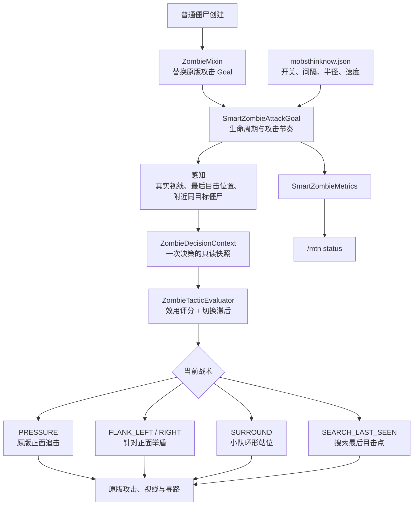

# 《怪物不再愚蠢 / Mobs Think Now》技术架构

> 当前状态：M0 首个可玩切片已实现并通过自动化构建。目标版本为
> Minecraft Java 26.1.2、Fabric Loader 0.19.3、Fabric API
> 0.155.2+26.1.2、Java 25。

## 1. 首板边界

- 只改造原版普通僵尸 `minecraft:zombie`；
- 服务端权威，客户端不增加自定义协议、模型或资源；
- 不提高生命、伤害、攻击速度或生成量；
- 不使用在线模型，不在运行时联网；
- 复用原版视线、目标、移动、寻路和攻击系统；
- Mixin 只负责替换普通僵尸的原版 `ZombieAttackGoal`。

尸壳、溺尸、僵尸村民及其他 Mod 实体暂不注入，以免首板兼容范围失控。

## 2. 已实现架构



代码职责：

```text
com.wjz.mobsthinknow
├─ MobsThinkNow                  Fabric 初始化入口
├─ ai/utility                    通用效用选择器
├─ ai/zombie
│  ├─ SmartZombieAttackGoal      与原版 GoalSelector 的边界
│  ├─ ZombieTacticalController   感知、记忆、小队、目的地和寻路
│  ├─ ZombieTacticEvaluator      无世界依赖的确定性战术评分
│  └─ SmartZombieMetrics         轻量运行指标
├─ command/MtnCommands           status 与 reload
├─ config                        JSON 配置加载、校验和热重载
└─ mixin/ZombieMixin             最小注入入口
```

## 3. 决策流程

每只拥有有效目标的普通僵尸执行以下流程：

1. 使用原版 `Sensing.hasLineOfSight` 更新真实视线；
2. 只有看见目标时才刷新最后目击位置；
3. 每隔默认 8 tick 建立一次决策快照；
4. 查询默认 12 格内、锁定同一目标的普通僵尸，并按实体 ID 稳定分配站位；
5. 对可用战术评分，只有新战术明显更优时才切换；
6. 正面施压继续使用原版近战 Goal；
7. 侧袭、包围和搜索只向原版导航器提交目的地；
8. 到达、目标死亡、记忆过期或配置关闭时退出战术。

决策使用确定性效用评分，并保留 4 分切换滞后，避免僵尸在多个战术之间每
tick 抖动。

## 4. 战术定义

| 战术 | 触发条件 | 执行方式 |
|---|---|---|
| `PRESSURE` | 单只僵尸、无更优策略，或小队第 1 位 | 完整保留原版追击与攻击 |
| `FLANK_LEFT` | 玩家正面举盾，当前僵尸不是施压位 | 移动到玩家朝向后侧的左翼 |
| `FLANK_RIGHT` | 同上 | 移动到玩家朝向后侧的右翼 |
| `SURROUND` | 多只僵尸锁定同一目标 | 按稳定索引分配环形目的地 |
| `SEARCH_LAST_SEEN` | 丢失视线但记忆未过期 | 前往最后真实目击位置 |

僵尸处于侧袭状态且仍在盾牌正面扇区时会暂缓挥击；走出正面扇区后重新交给
原版近战攻击逻辑。

## 5. 公平性约束

- 失去视线后不会更新玩家位置；
- 搜索阶段不会调用会朝墙后目标转头的原版近战 tick；
- 所有移动必须经过原版导航器，不传送、不穿墙；
- 首板不破坏方块，也不修改 `mobGriefing`；
- 攻击命中仍要求原版近战距离与真实视线；
- 关闭 `enabled` 或 `zombieAiEnabled` 后，已安装的 Goal 退回原版行为。

## 6. 性能约束

- 决策默认每 8 tick 一次，并按实体 ID 加 0–2 tick 错峰；
- 周围小队查询限定半径，参与协同的僵尸默认最多 8 只；
- 路径不会每 tick 重算；目的地接近现有路径目标时复用路径；
- 记忆、目的地和小队信息仅存在实体控制器内，不写入世界存档；
- 所有世界对象只在服务器主线程访问。

首板仍需补 50、100、200 只激活僵尸的 MSPT 压力基准，才能确定正式默认值。

## 7. 配置

配置文件：`config/mobsthinknow.json`

| 字段 | 默认值 | 作用 |
|---|---:|---|
| `enabled` | `true` | 总开关 |
| `zombieAiEnabled` | `true` | 僵尸 AI 开关 |
| `shieldFlanking` | `true` | 举盾侧袭 |
| `packSurrounding` | `true` | 小队包围 |
| `decisionIntervalTicks` | `8` | 决策间隔 |
| `targetMemoryTicks` | `60` | 最后目击记忆时间 |
| `maximumCoordinatedZombies` | `8` | 单次协同上限 |
| `coordinationRadius` | `12.0` | 小队查询半径 |
| `formationRadius` | `2.8` | 包围站位半径 |
| `flankBehindDistance` | `2.2` | 侧袭后向偏移 |
| `flankSideDistance` | `2.4` | 侧袭横向偏移 |
| `tacticalSpeedModifier` | `1.08` | 战术移动速度倍率 |

加载时会对所有数值进行范围校验；非法数值会被钳制到安全范围。

## 8. 验证体系

- Fabric Loader JUnit：效用选择、切换滞后、单只追击、盾牌侧袭、小队施压/
  包围、最后目击搜索；
- Minecraft 服务端 GameTest：真实加载 Fabric、Fabric API 和生产 Mixin，
  创建原版僵尸并确认智能攻击 Goal 安装；
- `build` 同时执行编译、单元测试、GameTest、资源处理和可发布 JAR 打包。

后续测试重点：

1. 固定竞技场中的实际绕盾轨迹；
2. 门洞、楼梯、水面、半砖和不可达侧袭点；
3. 目标快速转向与反复举盾；
4. 50/100/200 只僵尸的 MSPT 和内存；
5. 单人、专用服务器以及网易目标环境的回归。
