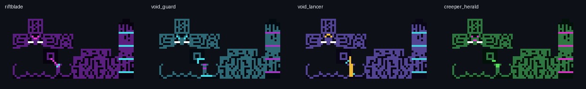

# 末影人职业与资源说明



## 职业表

| 职业 | 自然装备 | 战斗定位 | 核心节奏 |
| --- | --- | --- | --- |
| 裂隙猎手 `RIFTBLADE` | 铁剑 | 基础机动近战 | 有界侧后换位 → 命中 → 高智力概率闪退 |
| 虚空盾卫 `VOID_GUARD` | 石剑、虚空纹章盾 | 防守反击 | 举盾观察 → 真实格挡 → 2～4 tick 延迟 → 放盾反击 |
| 虚空枪骑 `VOID_LANCER` | 铁长矛 | 动能突击 | 有界换位 → 原版 `SpearUseGoal` 蓄力冲锋 |
| 苦力怕使者 `CREEPER_HERALD` | 空手 | 实体投送 | 预约苦力怕 → 真实抱取 → 正面近身投放 → 点燃撤离 |

四个身份使用稳定 byte 编号同步并随实体存档。末影人的凝视、南瓜伪装、受击和持续愤怒仍由原版
建立目标；职业 Goal 只在这个目标已经存在后决定如何战斗。

## 视觉约束

- 四张皮肤均为原版末影人 UV 尺寸 `64×32`，没有自定义实体模型依赖；
- 裂隙猎手使用品红裂隙、紫色甲片和青色能量边；
- 虚空盾卫使用青色重甲与紫色护面，盾牌本体由原版旗帜图层动态组成；
- 虚空枪骑使用金色肩甲、紫色能量纹和青色枪骑识别边；
- 苦力怕使者以绿色裂纹、品红束缚带和胸前苦力怕符号强调投送职责；
- 剑、盾和长矛通过原版 `ItemInHandLayer` 渲染，资源包仍可替换对应物品外观；
- 原版手持方块出现时，本帧隐藏手部武器，避免方块、装备和长臂互穿。

## 可复现生成

皮肤由仓库中的确定性脚本生成，不依赖手工导出的临时文件：

```powershell
python tools/generate_enderman_profession_skins.py `
  --output src/main/resources/assets/mobsthinknow/textures/entity/enderman `
  --preview docs/concepts/enderman-profession-skin-preview.png
```

发布前可以输出到临时目录并逐字节比对，确认脚本、仓库 PNG 与预览仍一致。测试还会验证资源路径、
尺寸和非透明像素，避免职业存在但皮肤漏包。

## 测试指令

```text
/mtn spawn enderman_hunter [数量]
/mtn spawn enderman_void_guard [数量]
/mtn spawn enderman_void_lancer [数量]
/mtn spawn enderman_creeper_bomber [数量]
/mtn spawnall endermen
```

其中盾卫和枪骑预设固定为 IQ 9，使状态机容易复现；苦力怕使者固定为 IQ 10，并预装一棵真实
末影人—苦力怕乘客树。所有批量入口先完成落点和碰撞预检，再事务式加入世界。
