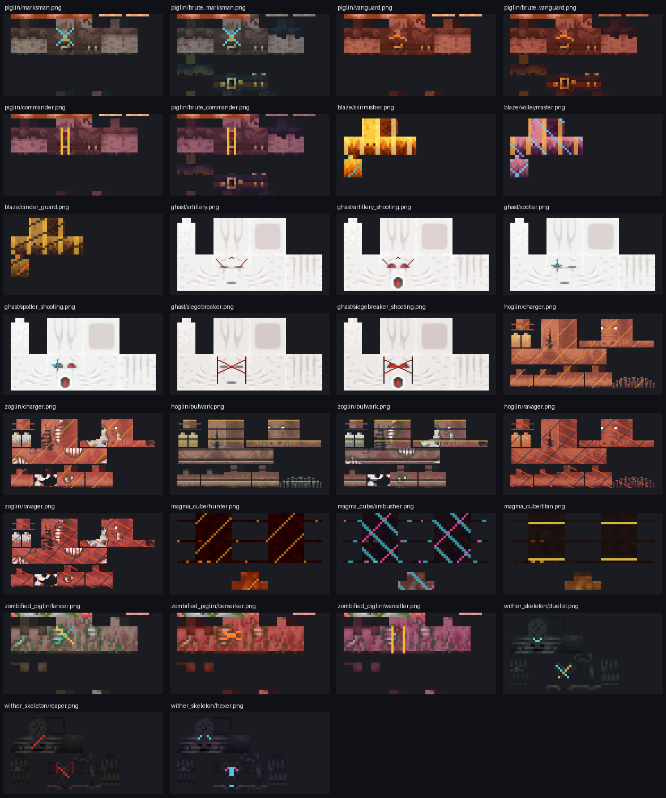

# 下界职业贴图与战术规范



## 设计目标

- 保留 Minecraft 26.1.2 原版模型、UV、透明边界和幼年模型，不引入 GeckoLib 等前置；
- 让玩家在正常战斗距离下通过主色、条带和脸部标记识别职业，而不是只靠常驻名牌；
- 外观必须对应真实战术差异，并由服务器同步的持久职业编号驱动；
- 所有生产 PNG 由脚本在原生像素分辨率生成，便于版本升级时从新客户端 JAR 重新构建。

## 职业矩阵

| 家族 | 职业 | 视觉语言 | 真实战术差异 |
|---|---|---|---|
| 猪灵 | 弩手 | 深青制服、青色交叉瞄具 | 保持后排射击通道，移动略稳健 |
| 猪灵 | 先锋 | 深红战衣、橙色锋线 | 更快侧后接敌 |
| 猪灵 | 指挥官 | 紫黑衣甲、双金色纵带 | 更集中地压住战线中部 |
| 烈焰人 | 空中散兵 | 原版火色、青色识别带 | 标准盘旋射程与弹幕 |
| 烈焰人 | 齐射大师 | 紫焰、蓝色能量纹 | 射程更远、弹幕 +1、瞄准更稳，但前摇更长 |
| 烈焰人 | 熔核近卫 | 煤黑金属、橙色裂纹 | 更近距离作战、弹幕较短、前摇更快 |
| 恶魂 | 机动炮兵 | 淡灰白、红色炮兵眉纹 | 标准预判和换位 |
| 恶魂 | 观测手 | 冷青白、单眼准星 | 预判与外圈观察半径更大 |
| 恶魂 | 攻城破坏者 | 灰白装甲感、黑红夹线 | 更近炮位，火球爆炸威力 +1 |
| 疣猪兽系 | 冲锋手 | 棕红皮、金色斜纹 | 标准蓄力与冲量 |
| 疣猪兽系 | 壁垒 | 灰黑横甲、金色边条 | 前摇更长、冲量更低，强调可读重装感 |
| 疣猪兽系 | 破阵者 | 深红交叉战纹 | 前摇更短、冲量更高 |
| 岩浆怪 | 猎手 | 深红熔岩、橙色细纹 | 标准预测跳扑 |
| 岩浆怪 | 伏击者 | 紫黑壳、青紫交叉纹 | 跳扑速度更高，展示体型为 2 |
| 岩浆怪 | 熔火泰坦 | 玄武岩黑、金色熔层 | 跳扑较稳，展示体型为 4 |
| 僵尸猪灵 | 长矛手 | 灰绿战衣、金青交叉矛纹 | 保留原版金矛冲刺和拉开循环 |
| 僵尸猪灵 | 狂战士 | 腐红战衣、橙色锋纹 | 怒吼蓄力后短突进，命中后短恢复 |
| 僵尸猪灵 | 战吼者 | 紫黑战衣、双金纵带 | 攻击后侧后撤，以更长窗口重找角度 |
| 凋灵骷髅 | 决斗者 | 冷灰骨骼、青金交叉剑纹 | 冷却阶段正面侧后撤 |
| 凋灵骷髅 | 收割者 | 黑红骨骼、猩红镰纹 | 8 tick 前摇后短突进 |
| 凋灵骷髅 | 咒火弓手 | 紫黑骨骼、青紫咒印 | 原版燃烧箭叠加有限移动预判 |

猪灵蛮兵会为弩手/先锋/指挥官分别生成蛮兵底图版本，虽自然蛮兵只会抽取先锋或指挥官；
疣猪兽与僵尸疣猪兽共享职业参数但各自保留原版骨骼/腐化细节；恶魂每个职业均提供普通和蓄力两张图。

## 资源清单

生产目录：

```text
assets/mobsthinknow/textures/entity/nether/
├─ piglin/       6 × 64x64
├─ blaze/        3 × 64x32
├─ ghast/        6 × 128x64
├─ hoglin/       3 × 128x64
├─ zoglin/       3 × 128x64
├─ magma_cube/   3 × 64x64
├─ zombified_piglin/ 3 × 64x64
└─ wither_skeleton/  3 × 64x32
```

合计 `30` 张 PNG。`NetherProfessionAssetsTest` 会从测试 classpath 逐张读取并验证数量与尺寸，
因此资源漏提交、损坏或误缩放会直接让构建失败。

## 重新生成

使用包含 Pillow 的 Python：

```powershell
python tools/generate_nether_profession_skins.py
```

脚本默认寻找 Loom 缓存中的 Minecraft 26.1.2 merged JAR，也可以显式指定：

```powershell
python tools/generate_nether_profession_skins.py `
  --minecraft-jar <MINECRAFT_MERGED_JAR> `
  --output src/main/resources/assets/mobsthinknow/textures/entity/nether `
  --preview docs/concepts/nether-profession-skin-preview.png
```

仓库不保存一份额外的原版源贴图；生成器直接读取与目标版本一致的本地客户端资源，随后只输出
本模组的派生职业贴图和预览图。
